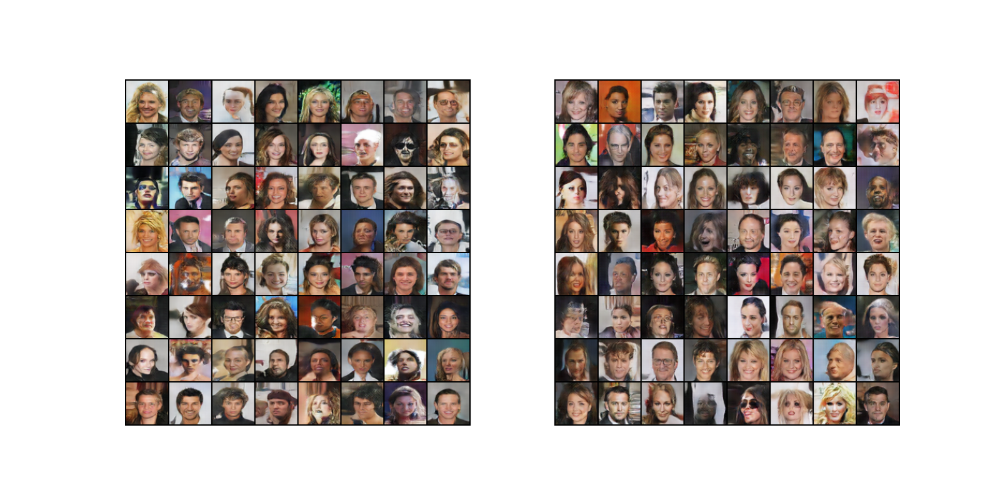
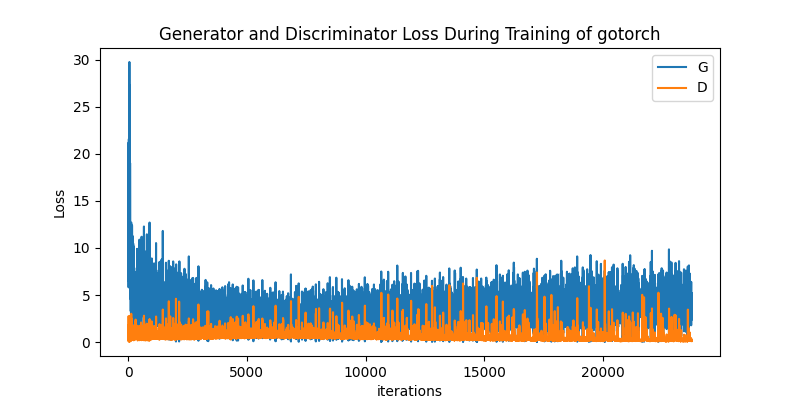
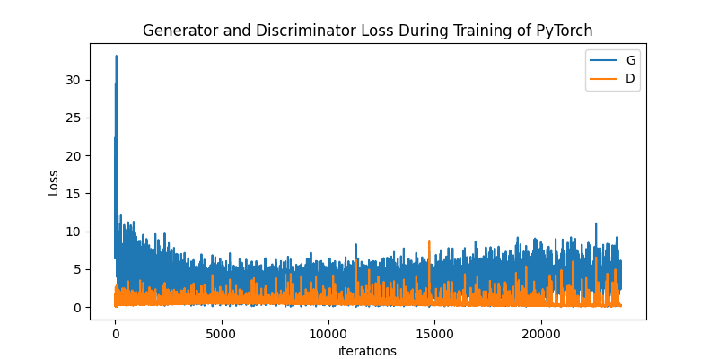

# DCGAN Demo

In this demo, we train a DCGAN using a human face dataset,
[CelebA dataset](http://mmlab.ie.cuhk.edu.hk/projects/CelebA.html), and use the
trained model to synthesize human faces.

The following shows fake faces synthesized using the GoTorch version
(left) and the PyTorch counterpart (right).
You can watch the detailed animation [here](http://cdn.sqlflow.tech/dcgan.mp4).



Training loss of GoTorch:



Training loss of PyTorch:



## Prepare the Data

From the Web page [CelebA
dataset](http://mmlab.ie.cuhk.edu.hk/projects/CelebA.html), we can choose to
download the ZIP archive `img_align_celeba.zip` from Google Drive or Baidu
Drive.

The following command unzip the archive and creates a tarball `train.tgz` of the
images shuffled in a random order.

```bash
unzip img_align_celeba.zip
tar czf train.tgz img_align_celeba
```

NOTE: If you work on macOS, you must install GNU tar.  Go's standard package
doesn't recognize macOS's BSD tar format.

```bash
brew install gnu-tar  # Use gtar instead tar in the above command.
```

## Build the Sample

Please follow the
[CONTRIBUTING.md](https://github.com/wangkuiyi/gotorch/blob/develop/CONTRIBUTING.md)
guide to build.

```bash
go install ./...
```

The `dcgan` binary will be installed at `$GOPATH/bin` directory.

## Run the Sample

The following command runs the sample program.

```bash
$GOPATH/bin/dcgan -data=$SOMEPATH/train.tgz 2>&1 | tee gotorch-dcgan.log
```

The training program periodically generates image samples and saves to pickle
files.  We provide a script to transform the saved pickle files into PNG format.

```bash
python visualize_pickle.py --load_gotorch=1 --save_image=1
```

And the script could also generate an animation to visualize
the training progress of generated fake images.
`ffmpeg` is needed to save the animation to mp4 format.

```bash
python visualize_pickle.py --load_gotorch=1 --save_video=1
```

To see the training loss curve:

```bash
python plot_loss.py --load_gotorch=1
```
