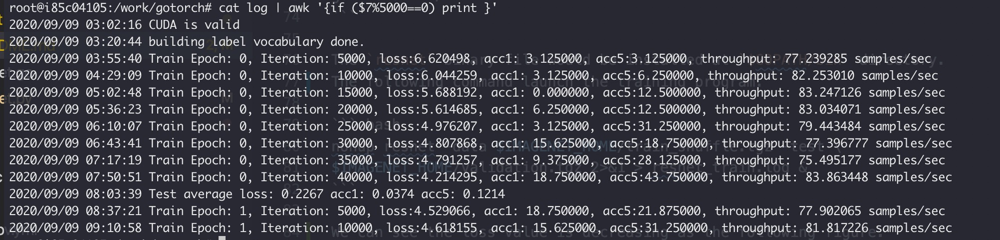

# ResNet Training Demo

This demo implements training the ResNet model on the ImageNet dataset.

## Prepare ImageNet Data

Because of the ImageNet dataset is not a public one, we should register
on the [ImageNet website](http://www.image-net.org/) then download the training
and validation tarball from the [download site](http://www.image-net.org/challenges/LSVRC/2010/downloads).

After finishing the downloading, you can create and export a home directory
to save the ImageNet data.

``` bash
mkdir -p ~/imagenet
export IMAGENET_HOME=~/imagenet
```

The following command extracts the tarball `ILSVRC2010_images_train.tar`
to `$IMAGENET_HOME/train`

``` bash
$mkdir -p $IMAGENET_HOME/train && tar xf ILSVRC2010_images_train.tar -C $IMAGENET_HOME/train
$cd $IMAGENET_HOME/train
$find . -name "*.tar" | while read NAME ; do mkdir -p "${NAME%.tar}"; \
tar -xvf "${NAME}" -C "${NAME%.tar}"; rm -f "${NAME}"; done
```

The following command extracts the tarball `ILSVRC2010_images_val.tar` to `$IMAGENET_HOME/val`

``` bash
$mkdir -p $IMAGENET_HOME/val && tar xf ILSVRC2010_images_val.tar -C $IMAGENET_HOME/val
$cd $IMGENET_HOME
$wget https://raw.githubusercontent.com/soumith/imagenetloader.torch/master/valprep.sh
$cd val && bash ../valprep.sh && cd ..
```

The extracted train and validation files like:

``` text
~imagenet/
  train/
  ├── n01440764
  │   ├── n01440764_10026.JPEG
  │   ├── n01440764_10027.JPEG
  │   ├── ......
  ├── ......
  val/
  ├── n01440764
  │   ├── ILSVRC2012_val_00000293.JPEG
  │   ├── ILSVRC2012_val_00002138.JPEG
  │   ├── ......
  ├── ......
```

The following command creates two tarballs, `train_shuffle.tgz` of
images in a shuffled order, `validation.tgz` of labeled images.

``` bash
$cd $IMAGENET_HOME
$find ./train | sort -R | tar zxf train_shuffle.tgz -T -
$find ./val | tar zxf validation.tgz -T -

```

## Build and Run the ResNet Binary File

Please follow the
[CONTRIBUTING.md](https://github.com/wangkuiyi/gotorch/blob/develop/CONTRIBUTING.md)
guide to build.

```bash
go install ./...
```

The `resnet` binary file would be installed at `$GOPATH/bin` directory.
The following command launch the training program.

``` bash
nohup resnet -data $IMAGENET_HOME/train_shuffle.tgz -test \
$IMAGENET_HOME/validation.tgz 2>&1 > resnet_train.log &
```

We can see the loss value is decreasing as the following screenshot.



## Benchmark with PyTorch

To compare with PyTorch, you can also run PyTorch example script: [resnet.py](/example/resnet/resnet.py).

On a Linux server with Nvidia P100 GPU, the following command can output the throughput
of GoTorch and PyTorch version:

GoTorch got throughput about `80 samples/secs`:

<!-- markdownlint-disable -->

``` bash
$go run example/resnet/resnet.go -data $IMAGENET_HOME/train_shuffle.tgz -test $IMAGENET_HOME/validation.tgz
2020/09/09 03:02:16 CUDA is valid
2020/09/09 03:20:44 building label vocabulary done.
2020/09/09 03:20:52 Train Epoch: 0, Iteration: 10, ... throughput: 75.588993 samples/sec
2020/09/09 03:20:56 Train Epoch: 0, Iteration: 20, ... throughput: 81.110672 samples/sec
2020/09/09 03:21:00 Train Epoch: 0, Iteration: 30, ... throughput: 78.099667 samples/sec
2020/09/09 03:21:04 Train Epoch: 0, Iteration: 40, ... throughput: 83.487386 samples/sec
...
```

<!-- markdownlint-restore -->
PyTorch got the throughput about `23 samples/secs`:

``` bash
$python example/resnet/resnet.py -data $IMAGENET_HOME/train -test $IMAGENET_HOME/
epoch: 0, batch: 10, loss: 9.453032, ... throughput: 21.507074 samples/sec
epoch: 0, batch: 20, loss: 10.184307, ... throughput: 24.095710 samples/sec
epoch: 0, batch: 30, loss: 7.609190, ... throughput: 23.886803 samples/sec
epoch: 0, batch: 40, loss: 7.043211, ... throughput: 24.335507 samples/sec
...
```
